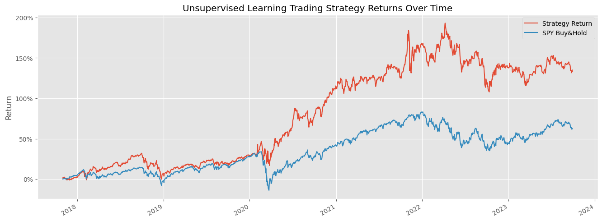
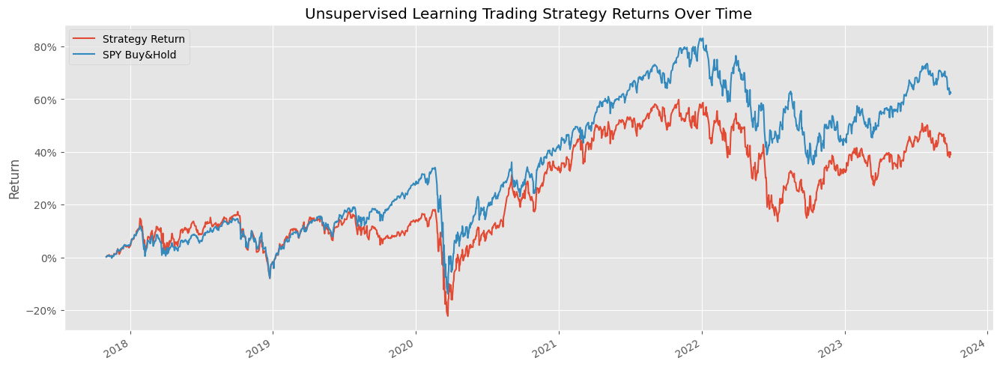

# Unsupervised Dynamic Portfolio Allocation

## What's This All About?
This project dives into managing investment portfolios using data from S&P500 stocks between 2015 and 2023. The goal is to create a smart strategy that adjusts dynamically based on market conditions.The data is processed to include various features and indicators, and the portfolio management strategy involves clustering stocks based on momentum indicators for dynamic allocation.

## Data Loading and Processing

The project begins with loading and formatting S&P500 equity data from Yahoo Finance for the years 2015-2023.

## Features and Indicators

The following indicators are used:

- Garman-Klass Volatility
- Relative Strength Index (RSI)
- Bollinger Bands
- Average True Range (ATR)
- Moving Average Convergence and Divergence (MACD)
- Dollar Volume

The Dollar Volume is utilized to aggregate and resample data at a monthly level, ensuring the selection of the 150 most liquid stocks each month.

## Percentage Return Calculation

Percentage returns for different time lags (1, 2, 3, 6, 9, 12 months) are calculated for each stock.

## Fama-French Five Factor Model

The Fama-French Five Factor model is imported to find the rolling factor betas for the stocks.

## Rolling Factor Betas Calculation

Rolling factor betas are calculated using regression, treating the Fama-French factors as constants.

## Data Filtering

Stocks lacking sufficient data for the mentioned steps are filtered out.

## Mega DataFrame Creation

All calculated indicators, returns over different time lags, and Fama-French factors are combined into a comprehensive DataFrame.

## KMeans Clustering

KMeans clustering is employed, using RSI and ATR as axes, to group stocks into clusters. The hypothesis revolves around momentum strategies.

## Portfolio Optimization

The top-performing cluster (Cluster 01) is selected for portfolio optimization. The Efficient Frontier Portfolio optimization function is used to find the ideal portfolio with Max Sharpe ratio weights.

## Results and Visualization

The portfolio returns are visualized and compared to a buy and hold S&P500 strategy, serving as a benchmark.

### Cluster 01 Portfolio Returns

The Cluster 01-based portfolio shows remarkable performance, achieving returns close to 150-180%, outperforming the S&P500 benchmark.

### Cluster 03 Portfolio Returns

Cluster 03 underperforms, lagging by 20-30% and reaching only 60% returns.

